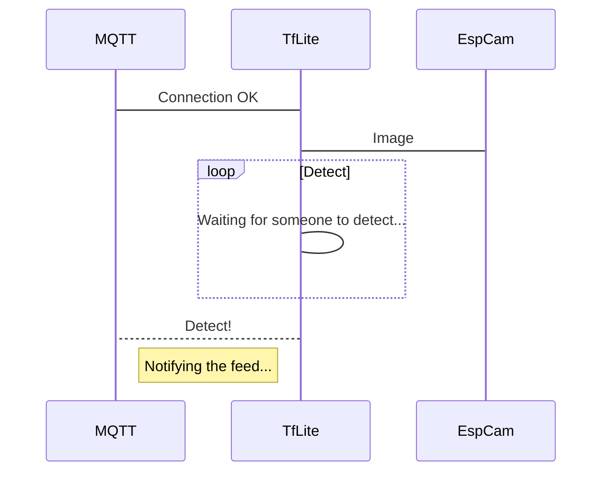

auteurs : Antoine REBOULLET et Arthur CARON

# Listes des fonctionnalités :

1. **Completed features**
  1. [x] chatbot CPE Lyon avec google actions
  2. [x] communication entre smartphone Android (assistant google) et ESP32 TTGO Camera via IFTTT, Adafruit I/O, MQTT, SMS
  3. [x] algorithme de détection de visage tensorflow lite implémenté sur ESP32
  4. [x] entrainement et implémentation de notre propre réseau de neurones avec google collab (chien/chat) sur l'ESP32
2. **Incomplete features**
  1. [ ] Intégration du nouveau réseau chien/chat dans le projet complet (à la place de la détection de personnes)

# Description de l'algo

# Vidéos de présentation

[Lien vers la vidéo pitch youtube](https://youtu.be/RfW1v6fOTm0)

[Lien vers la playlist tuto sur youtube](https://www.youtube.com/watch?v=tZROr2DXRhs&list=PLtyfMlqaig19DtzgwDwA6et28mcuCLIC2)

# Liste des dépendances et pré-requis

- Config Adafruit IO :
IO - Dashboard > My key > 
#define AIO_USERNAME  "cpedemoiot"
#define AIO_KEY       "aio_dpYr78aKsRuj9p4znJCSG9qgfQWd"

Config Arduino IDE & esp 32 :

Croquis > Inclure une bibliothèque > Gérer les bibliothèques > 
- Adafruit MQTT
- Wifi
- Adafruit_GFX
- Adafruit_SSD1306
- TensorFlowLite_ESP32

Préférences > URL > https://dl.espressif.com/dl/package_esp32_index.json
Carte : ESP32 Dev Module
Example : CameraWebServer
Partition scheme : Huge APP
PRAM ENABLE
réécrire camera_pins.h (sauf 2 premières lignes) avec valeurs de pins (boite)

# Procédure de mise en route

- Mettez votre ESP32 sous tension et assurez-vous qu'il est bien connecté au réseau local
- Dites à votre assistant: "OK Google, parler avec chatbot CPE Lyon"
- Dites à votre assistant: "OK Google, projet majeure"
- Placez vous devant la caméra de l'ESP32 (ou des images de chien/chat en fonction de l'algo) pour qu'il effectue la détection 
